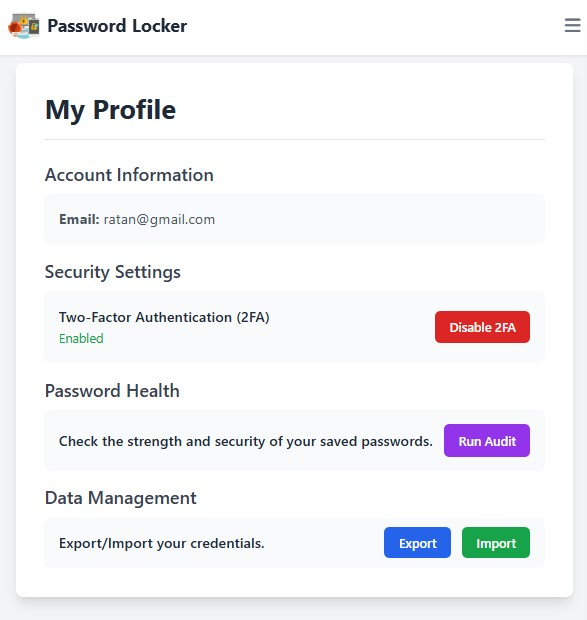

# 🔐 Password Locker

[](LICENSE)  [](https://www.python.org/)  [](https://flask.palletsprojects.com/)

## Overview

Password Locker is a Flask-based web application designed to keep your account details safe, secure, and easily accessible. It helps you manage your passwords efficiently while ensuring top-level protection.

---

## Features

- Secure storage of account credentials
- User-friendly interface built with Flask, HTML, CSS, and JavaScript
- Easy account addition, update, and deletion
- Password encryption and security best practices (if applicable)
- Responsive design for desktop and mobile

---

## Screenshots

**Login Page**

*Login page for secure access*

**Dashboard**

*Dashboard to view and manage passwords*

**Add New Details**

*Form to add new account details*

**Profile Settings**

*User profile settings page*

**Password Audit**

*Password audit and analysis dashboard*

---

## Installation

Follow these steps to set up and run Password Locker locally:

1. **Clone the repository**  
   ```
   git clone https://github.com/basantrawat/Password-Locker.git
   cd Password-Locker
   ```

2. **Create and activate a virtual environment**  
   ```
   python3 -m venv venv
   source venv/bin/activate   # On Windows use: venv\Scripts\activate
   ```

3. **Install dependencies**  
   ```
   pip install -r requirements.txt
   ```

4. **Create the database**  
   The database file is not included, so create your own database named `pass_locker` following the necessary schema.

5. **Run the app**  
   ```
   flask run
   ```
   Open your browser and navigate to `http://127.0.0.1:5000`

---

## Usage

- Register or login with your credentials.
- Add new account details securely.
- Update or delete existing accounts.
- Explore and manage your stored credentials easily.

---

## Tech Stack

- **Backend:** Python, Flask
- **Frontend:** HTML, CSS, JavaScript
- **Database:** MySQL

---


## License

This project is licensed under the MIT License - see the [LICENSE](LICENSE) file for details.

---


*Thank you for using Password Locker! Stay safe and secure.*  
